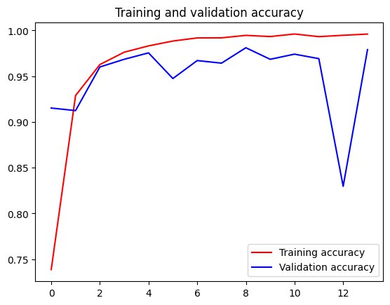
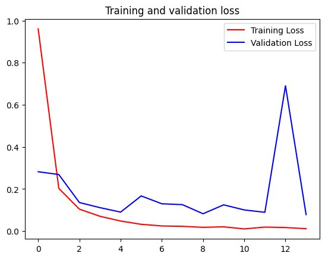
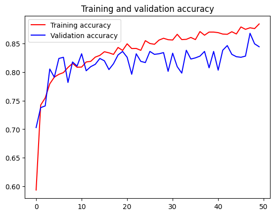
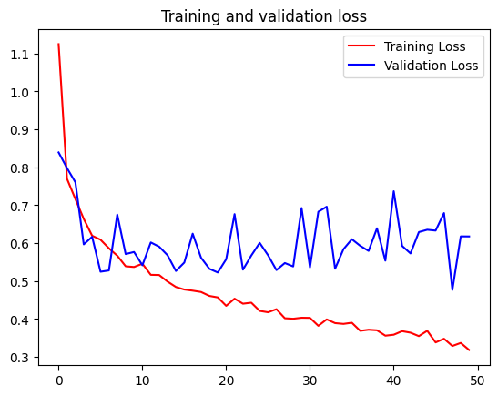

# Attirely-ML

This is documentation of Machine Learning model of Attirely - Bangkit Academy Capstone Project App

# Model  Notebook
- [Type Classification Notebook](https://colab.research.google.com/drive/1jjA_i30Ot_Bm7GhUIsVykikz2vfJc78W?usp=sharing)
- [Color Classification Notebook](https://colab.research.google.com/drive/11tCnYZqruJIZKV4F6FOf2s7ANvys_NfE?usp=sharing)

# Dataset Resources
- [Cloth Type Dataset](https://universe.roboflow.com/attirely-senang/attirely-hmm)
- [Color Dataset](https://universe.roboflow.com/mariomartuaa/attirely-color)

## EffecientNet-B0 Architecture for Type Model

  

## Color Model Architecture

  

# Type Model Accuracy and Loss

  
  

- **Type Model Accuracy:**
  - Training Accuracy: 99.60%
  - Validation Accuracy: 97.90%

---

# Color Model Accuracy and Loss

  
  

- **Color Model Accuracy:**
  - Training Accuracy: 88.41%
  - Validation Accuracy: 84.43%

# References
- Aneesh K, P V Rohith Kumar, Sai Uday Nagula, Archana Nagelli. Fashion Recommendation System. 2022.  [IJRASET](https://tfhub.dev/google/collections/landmarks)
